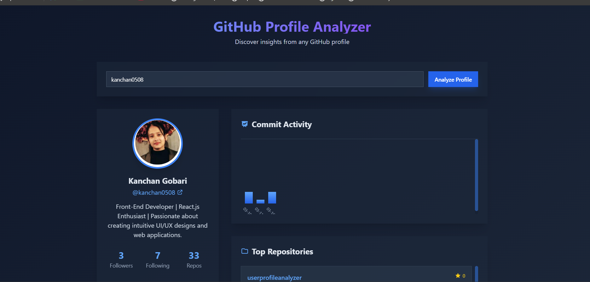

# User Profile Analyzer

This project is a GitHub Profile Analyzer built using React, ShadCN UI components, and TypeScript. It allows users to input a GitHub username and view their public activity metrics, including:

- A list of repositories
- An advanced daily commits chart

## Features

- **Search GitHub Profiles**: Enter a GitHub username to fetch and display profile details.
- **Repository List**: View a list of public repositories with details like stars, description, and language.
- **Commit Activity Chart**: Visualize daily commit activity over the last 90 days.
- **Responsive Design**: Fully responsive and optimized for all screen sizes.
- **Modern UI**: Built with ShadCN components for a professional and attractive interface.

## Technologies Used

- **React**: For building the user interface.
- **ShadCN**: For pre-built, customizable UI components.
- **TypeScript**: For type-safe development.
- **Vite**: For fast development and build tooling.
- **Tailwind CSS**: For styling and layout.

## Getting Started

Follow these instructions to set up and run the project locally.

### Prerequisites

Ensure you have the following installed:

- Node.js (v16 or later)
- npm (v7 or later)

### Installation

1. Clone the repository:

   ```bash
   git clone <repository-url>
   cd UserProfileAnalyzer
   ```

2. Install dependencies:

   ```bash
   npm install
   ```

3. Start the development server:

   ```bash
   npm run dev
   ```

4. Open your browser and navigate to `http://localhost:5173`.

### Building for Production

To build the project for production:

```bash
npm run build
```

The production-ready files will be in the `dist` directory.

### Deploying

You can deploy the `dist` folder to any static hosting service, such as:

- [Vercel](https://vercel.com/)
- [Netlify](https://www.netlify.com/)
- [GitHub Pages](https://pages.github.com/)

## How to Use

1. Enter a GitHub username in the input field.
2. Click the "Analyze Profile" button.
3. View the user's profile details, repository list, and commit activity chart.

## Screenshots

### Home Page



## Google Drive Link

[Download the project zip file](https://drive.google.com/file/d/your-google-drive-link/view?usp=sharing)


